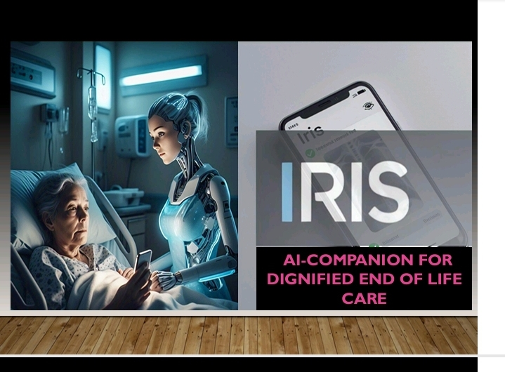

# iris-ai-care-deepseek-hack
IRIS AI End of Life Care Agents
# My Project
This is my project description.
## Screenshot
Here’s a screenshot of the app:

For more information, visit our [project website](https://iris.gemgrocery.com).
## Description
### IRIS AI is an empathetic AI-powered palliative care platform designed to provide personalized support and guidance to terminal patients, the aged and their families.

# Features
## Rx Contraindications Checking Tesseract Microservice
we use Tesseract OCR to predict possible medicine contraindications for patients whose eye don't see. This helps RXs to be safely dispensed and taken by those at end of life treatment at home. Especially where family members are not well versions.
# Patient Queing, Tickets  
AI-driven triaging to predict priorities and offer seamless handoffs to microservices  

## Natural Language Processing (NLP) for empathetic interactions
- Personalized support and guidance

## Emergency Calls 
Integration with USSD systems and wearable devices
- Computer Vision capabilities for gsstures movement analysis.

## Medical Image classification
This module detects disease progressions using CXR & DICOM  for better predictive care and reinforced leading.

# Architecture 
IRIS Caregiver AI employs a swarm of microservices, leveraging Streamlit for a seamless user experience

## DEEPSEEK AS Edge LLM:
Cutting-edge Large Language Model (LLM) Agents formation at edge, coordinating with each other longitudinally that enables bidirectional intelligence hierarchy,  microservices orchestration and harmonisation with patient queues and sendoffs. 

## Microservices Swarm: 
A collection of specialized microservices that work in tandem to provide a comprehensive AI experience.

## Bidirectional Intelligence Hierarchy & Orchestration Edge LLMs.
Our Edge LLM facilitates bidirectional intelligence hierarchy, enabling Edge Processing for some cases with no need to call microservices.

### Bottom-up Learning: 
Microservices can learn from user interactions and adapt to their needs.
### Top-down Guidance
The Edge LLM provides strategic and tactic requests to the microservices swarm

# Technologies Used
## AIML API
Powers all microservices for special patient cases, send offs & retrieval such as CXR Disease progression Pretrained models. 

### JavaScript/Php
### NLU/NLP
### LLM
### Python
### Streamlit microservices 
### Machine Learning Models

# Dependencies 
- AIML API
- OpenAi
- Google Studio [fallback edge llm)
- Tesseract.py OCR
- Natural Language Toolkit (NLTK)
- Jupyter Notebooks and Gdrive for TensorFlow tf.keras on prem ML training and testing
- PyTorch

# EXTENSIONS
- Google DeepMind
- Whisper
- MTN USSD
- AI/ML API

# Installation
To install IRIS AI, follow these steps:
1. Clone the repository: `git clone https://github.com/your-username/iris-ai.git`
2. Install dependencies: `pip install -r requirements.txt`
3. Start a Microservice: `streamlit run app.py`

Directory Structure
- `iris_ai/`: Core AI engine and NLP models DEEPSEEK & GEMINI FLASH PRO
- `app/`:  web application (demo)
- `data/`: Sample data and testing datasets
- `docs/`: Documentation and guides
- `tests/`: Unit tests and integration tests
- `services/`: Microservices swarm

## Future Development
- Integrate Computer Vision capabilities for human movement analysis and image classification
- Explore applications in healthcare, sports analytics, and assistive technology.
